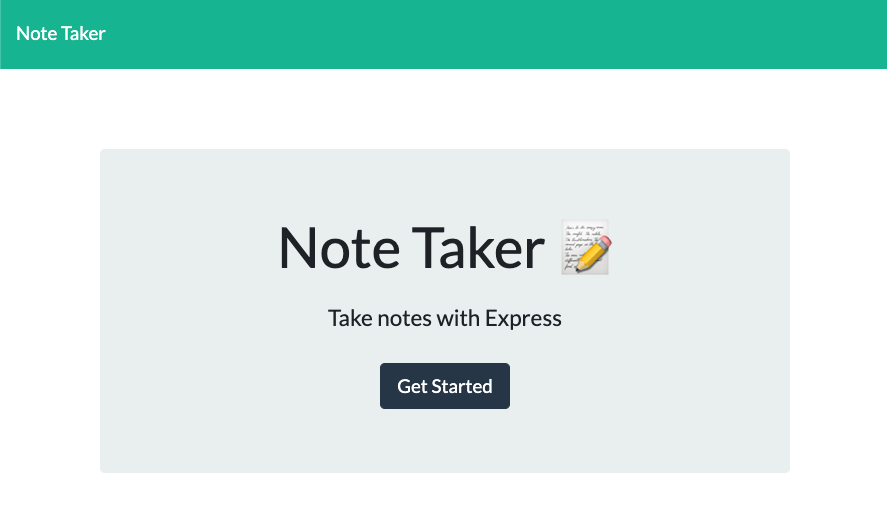
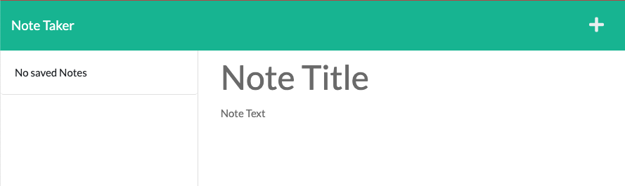
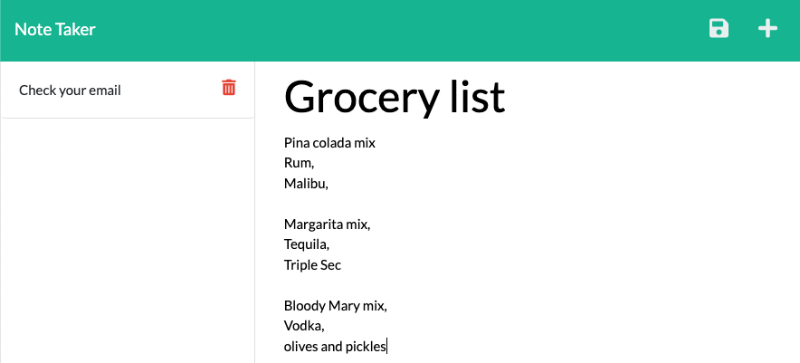

# take-some-notes
          
  ## Description
  This is a web application that lets the user write and save notes. It can help you stay organized and is great to jot down a quick idea or two. It uses node.js along side a few other dependencies, such as express for server handling, and fs for storing your data to a file. 
  
  ## Table of Contents
  * [Installation](#installation)
  * [Usage](#usage)
  * [License](#license)
  * [Questions](#questions)
  * [GitHub](#github)
  * [Email](#email)
  
  ## Installation 
  To install, simply clone the repository into your bash or shell, and run an `npm i` to download the required dependencies. You will then be ready to use the note taker!
  
  ## Usage 
  To start the application, run `npm start` in your command-line. It will then start a server locally. If this is successful, it will say 
  
                    Server now running on your port!
                    
  
  
  After your servers up and running, you can navigate to your localhost: in the browser, it will tell you which port it is running on in the console. You will then be greeted with the landing page. Go ahead and press `Get Started`.

  Congratulations, you made it to the home screen! You can now start taking notes. If you have any saved, they will appear on the left hand column, if not it will say `no saved Notes`

You can enter a note title and text, if you would like to save it, press the `save icon`  in the top right hand corner and your note will join your other notes on the left side column.

  ## License
  ### Badges
  
  ### Links to licenses
  https://opensource.org/licenses/MIT

  ## Questions
  If you have any questions, feel free to reach out and contact me via email.
  ### Email
  kieranhan1999@gmail.com
  ### GitHub
  www.github.com/KieranHannagan
  

  
